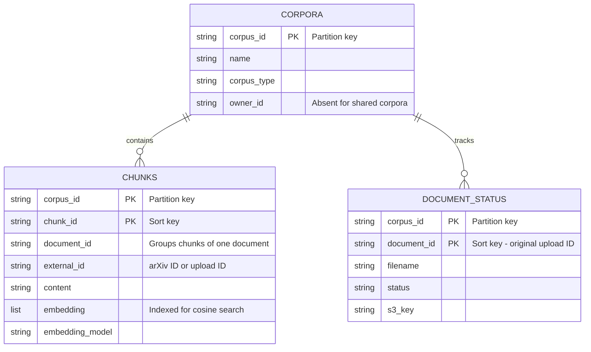
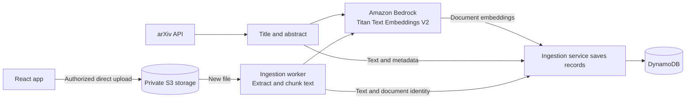
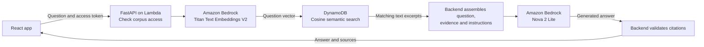

# Research Agent

Research Agent helps users understand a collection of research without having to locate every relevant passage manually. Users can ask about a topic, compare approaches, or explore connections across papers and documents, then follow the citations back to the evidence behind an answer.

The app supports two starting points: a shared collection of arXiv research abstracts and private collections of documents uploaded by the user. Its purpose is to support discovery and reading by making those collections easier to question and explore. The original sources remain available for checking claims and investigating details.

Under the hood, it uses retrieval-augmented generation (RAG): it finds relevant text in the selected collection and supplies that evidence to a language model to compose an answer. The sections below explain the user experience, system architecture, ingestion and retrieval flows, APIs, and codebase.

**[Try the app on Vercel](https://research-agent-iota.vercel.app/)** — create an account or sign in to get started.

## What you can do

- Ask about findings, methods, and connections within a selected corpus.
- Explore the subjects covered by a corpus through overview questions.
- Create private corpora and upload PDF, TXT, or Markdown files.
- Preview uploaded documents, track processing, and delete documents or corpora.
- Review citations, source links, and retrieval distances alongside an answer.

## Stack and architecture

| Layer | Technology | Role |
| --- | --- | --- |
| Web application | React, TypeScript, Vite | Corpus management, uploads, questions, and source display |
| Frontend hosting | Vercel | Builds and serves the web application |
| Authentication | Amazon Cognito, AWS Amplify | Sign-up, sign-in, and browser access tokens |
| HTTP API | FastAPI, Pydantic, API Gateway | Validated requests, authentication, and corpus access checks |
| Compute | AWS Lambda, Mangum | Runs FastAPI and a separate document ingestion worker |
| Database | Amazon DynamoDB with native vector search | Corpus metadata, document chunks, embeddings, and ingestion status |
| File storage | Amazon S3 | Private original uploads and direct browser uploads |
| Embeddings | Amazon Titan Text Embeddings V2 via Bedrock | Converts text into normalized vectors; 1,024 dimensions by default |
| Answer generation | Amazon Nova 2 Lite via Bedrock | Synthesizes answers from retrieved evidence |
| Infrastructure | AWS SAM | Defines the API, functions, authentication, and AWS permissions |

### Why this structure

The frontend handles interaction while the backend owns access checks, retrieval, and model calls. API Gateway validates Cognito tokens, and the API checks corpus ownership before accessing private data. AWS service credentials remain on the backend.

DynamoDB holds both document records and their searchable vectors, avoiding a separate vector database and a second copy of source metadata. Three tables separate corpus definitions, embedded chunks, and upload status. A document can have many chunks, but citations and document counts refer to distinct documents.

Original files live in S3. A short-lived upload authorization lets the browser send file bytes directly to S3, keeping file transfer out of the API request. A separate Lambda performs extraction and embedding asynchronously, so uploading a file does not require waiting for all its text to be processed. Status records let the frontend show progress; failed worker invocations have retries and an SQS failure destination.

Embedding and generation are separate operations. Titan provides a common vector representation for stored text and questions; Nova receives the selected text as evidence when composing an answer. This lets the app retrieve from a specific corpus without putting the entire collection into the model prompt.

Document counts load separately from the corpus list so expensive counting does not block corpus selection or questions.

### DynamoDB structure

The database uses three tables. In this ERD, fields marked **PK** together form a table's primary key; comments distinguish DynamoDB partition and sort keys. Relationships are managed by the application, not enforced as foreign keys.



Table names use the `research-agent-` prefix: `corpora`, `chunks`, and `document-status`. They store corpus ownership, document text and embeddings, and upload progress respectively. The chunks table's vector index searches the `embedding` field using cosine distance, scoped to a corpus and filtered by embedding model.

Chunks sharing a `document_id` belong to the same document. Their sort keys take the form `document_id#chunk:000000`, `document_id#chunk:000001`, and so on. arXiv papers typically have one title-and-abstract chunk; uploaded files can have many.

The status table tracks uploads only. Its `document_id` is the original upload ID, stored as `external_id` on the corresponding chunks; the chunks' own `document_id` is derived from the source and external ID. Original file bytes remain in S3. Vector search returns matching chunk keys and distances, then the backend fetches the text and metadata from the chunks table.

## How documents become searchable

Both ingestion paths turn source text into embeddings and store the text alongside its vectors.



### arXiv papers

The [arXiv client](backend/app/clients/arxiv_api_client.py) queries the Atom API and normalizes paper metadata into validated records: title, abstract, authors, identifiers, dates, categories, license, and source URL. Requests are paced within the client process.

The [ingestion service](backend/app/services/arxiv_ingestion.py) combines each paper's **title and abstract**, generates a Titan embedding, and stores the text, vector, and metadata in DynamoDB. Existing embeddings are reused when the text and embedding configuration have not changed. The interactive entry point is [arxiv_import_metadata.py](backend/app/scripts/arxiv_import_metadata.py).

This path indexes abstracts rather than full paper PDFs. Questions in the web app search the stored corpus; they do not run a live arXiv search on every request.

### Uploaded documents

1. The browser requests upload authorization with a filename and file size. The API checks ownership and file constraints, creates a status record, and returns a presigned S3 POST.
2. The browser uploads the file directly to S3. Supported files are PDF, TXT, and Markdown, up to 5,000,000 bytes each.
3. An S3 object-created event invokes the ingestion worker. It checks the upload record and reads the file.
4. The ingestion service extracts text and splits it into chunks of **2,000 characters with 200 characters of overlap**. The overlap preserves some context across chunk boundaries.
5. Titan embeds each chunk. The worker stores the chunks and their document identity in DynamoDB, then marks the upload ready. The frontend polls for status.

PDF extraction uses `pypdf`; scanned PDFs need OCR before upload. TXT and Markdown files must contain UTF-8 text. Retrieval excludes uploaded chunks whose upload record is missing or not ready.

## How an answer is produced

The backend coordinates the following flow for a semantic-search question. Both arXiv papers and uploaded documents use this same answering path.



Titan embeddings locate relevant documents; **Nova receives their text excerpts, not their vectors**. The arrows represent the data flow managed by the backend, rather than direct calls between AWS services.

1. **Check access.** The API verifies that the selected corpus is shared or belongs to the signed-in user.
2. **Embed the question.** Titan converts the question into a vector using the same configured embedding model as the stored text.
3. **Retrieve evidence.** DynamoDB performs cosine vector search filtered by corpus and embedding model. The UI currently requests five candidate chunks. Multiple chunks may come from the same document, so five chunks do not necessarily mean five papers.
4. **Assemble context.** Retrieved excerpts are grouped by document, giving each document one citation number while retaining its matching excerpts.
5. **Generate an answer.** Nova receives the question, evidence, and grounding instructions. It is instructed to avoid unsupported claims and recommend relevant material when evidence is insufficient. Brief, explicitly identified general background is permitted for introductory explanations.
6. **Validate references.** The backend checks source IDs, duplicates, citation-list consistency, and requested source counts. Titles and URLs come from stored records. Invalid or incomplete model output gets one retry before a handled error is returned.

By default, the source list contains only cited documents. If a question requests a number of sources, the model can select up to that many relevant distinct documents, with uncited selections labeled **Additional relevant sources**. It is instructed not to pad the list with unrelated material. Relevance and factual support remain model judgments; reference validation checks structure and provenance.

The displayed distance comes from retrieval, not the language model; lower cosine distance indicates a closer match. Broad corpus-overview questions take a separate path: an inventory of up to 100 documents supplies abstracts or opening excerpts instead of the usual nearest-neighbor search. Those sources display **Overview** rather than a distance.

## API overview

Application endpoints require a Cognito access token in `Authorization: Bearer <token>`. The health endpoint is public. Private corpus and document operations check ownership.

| Method | Route | Purpose |
| --- | --- | --- |
| GET | `/health` | Service health check |
| GET | `/api/corpora` | List shared and user-owned corpora |
| POST | `/api/corpora` | Create or reuse a named private corpus |
| GET | `/api/corpora/{corpus_id}/document-count` | Load a corpus's document count independently |
| DELETE | `/api/corpora/{corpus_id}` | Delete an owned corpus and its documents |
| GET | `/api/corpora/{corpus_id}/documents` | List uploaded documents and processing statuses |
| POST | `/api/corpora/{corpus_id}/documents` | Authorize a direct S3 upload using filename and size |
| GET | `/api/corpora/{corpus_id}/documents/{document_id}/status` | Check ingestion progress |
| GET | `/api/corpora/{corpus_id}/documents/{document_id}/content` | Retrieve an uploaded file for preview |
| DELETE | `/api/corpora/{corpus_id}/documents/{document_id}` | Delete an uploaded file and its indexed chunks |
| POST | `/api/rag/answer` | Retrieve evidence and return an answer with source records |

An answer request has this shape:

```json
{
  "corpus_id": "selected-corpus-id",
  "question": "What approaches to retrieval are discussed?",
  "limit": 5,
  "max_tokens": 600
}
```

The response contains `question`, `answer`, and `sources`. Each source includes its citation number, document ID, title, URL when available, retrieval distance, and whether it is cited or additional. See [api_schemas.py](backend/app/schemas/api_schemas.py) for the request and response models and [main.py](backend/app/main.py) for route behavior.

## Codebase guide

| Location | Responsibility |
| --- | --- |
| [frontend/src/App.tsx](frontend/src/App.tsx) | Authentication screens, Ask and My Corpora views, API requests, and UI state |
| [frontend/src/main.tsx](frontend/src/main.tsx) | React entry point and Cognito configuration through Amplify |
| [frontend/src/uploadDocument.ts](frontend/src/uploadDocument.ts) | Upload authorization and direct transfer to S3 |
| [frontend/src/App.css](frontend/src/App.css) | Application layout and styling |
| [backend/app/main.py](backend/app/main.py) | FastAPI routes, ownership checks, previews, and deletion |
| [backend/app/schemas/](backend/app/schemas/) | Pydantic validation at API and model-output boundaries |
| [backend/app/clients/](backend/app/clients/) | arXiv HTTP client and Bedrock embedding/generation clients |
| [backend/app/services/](backend/app/services/) | Ingestion, text splitting, vector retrieval, prompts, and citation resolution |
| [backend/app/database/](backend/app/database/) | Typed stored records, DynamoDB connections, and repository operations |
| [backend/app/workers/document_ingestion_worker.py](backend/app/workers/document_ingestion_worker.py) | S3 event processing and upload lifecycle management |
| [backend/template.yaml](backend/template.yaml) | SAM infrastructure and service permissions |
| [backend/tests/](backend/tests/) | Offline unit tests and opt-in AWS integration checks |
| [frontend/tests/](frontend/tests/) | Upload-flow tests |

The backend follows a route → service → client/repository structure: routes deal with HTTP and access, services coordinate application behavior, and clients and the repository isolate external calls. This separation makes retrieval, ingestion, and error handling testable without live AWS requests.

## Acknowledgements

Thank you to arXiv for use of its open access interoperability.

This project uses the [arXiv API](https://info.arxiv.org/help/api/index.html) to access research metadata. Research Agent is an independent project and is not affiliated with or endorsed by arXiv. Credit belongs to the researchers whose papers provide the underlying source material.
